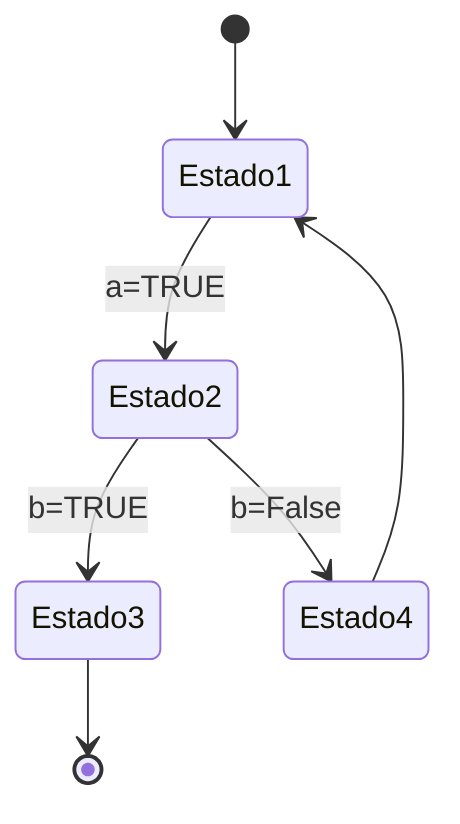

# Máquina de Estados... de Café

## Diagrama ejercicio previo



## Diagrama Máquina

```mermaid
stateDiagram-v2
    [*] --> Idle
    Idle --> ServingCoffee: makeCoffee()
    ServingCoffee --> [*]: clean()
    Idle --> Idle: clean()
    ServingCoffee --> ServingCoffee: makeCoffee()
    Idle --> Error: error
    Error --> [*]: clean()
    ```